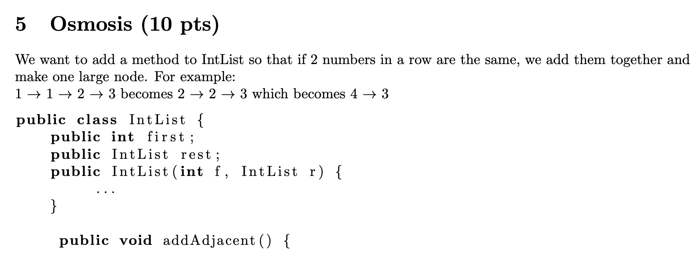

# Week 2 - Notes

## Exercise B Level

1. Starting from the copy of SLList.java provided to you in the lecture code repository, implement the method `deleteFirst`, which deletes the first element in your SLList. Don’t forget to maintain the three invariants discussed above.
2. Starting from the copy of SLList.java provided to you in the lecture code repository, implement a second constructor that takes in an array of integers, and creates an SLList with those integers. Again, remember to maintain your invariants.

<!-- more -->

```java
// Code for the question 1 and 2

import edu.princeton.cs.algs4.In;

//import java.util.Arrays;

// Using sentinel to replace the first

public class SLList2 {
    private static class IntNode {
        public int item;
        public IntNode next;

        public IntNode(int i, IntNode n) {
            item = i;
            next = n;
        }
    }

    private IntNode sentinel;
    private int size;

    public SLList2() {
        // initialize with no inputs
        sentinel = new IntNode(63, null);
        size = 1;
    }

    public SLList2(int x) {
        // initialize with a integer
        sentinel = new IntNode(63, null);
        sentinel.next = new IntNode(x, null);
        size = 1;
    }

    public SLList2(int[] x) {
        // initialize with an array
        size = 0;
        sentinel = new IntNode(63, null);
        for (int i = 0; i < x.length; i++) {
            // get the item from array inversely
            sentinel.next = new IntNode(x[x.length-i-1], null);
            size += 1;
        }
    }

    /** Add the first item in the list */
    public void addFirst(int x) {
        sentinel.next = new IntNode(x, sentinel.next);
        size += 1;
    }

    /** Returns the first item in the list */
    public int getFirst() {
        return sentinel.next.item;
    }

    /**
     * Returns the last item in the list
     * @return the last item
     */
    public int getLast() {
        if (sentinel.next == null) {
            return sentinel.item;
        }
        sentinel = sentinel.next;
        return getLast();
    }

    /**
     * Add an item to a list
     * @param args int x
     */
    public void addLast(int x) {
        size += 1;
        IntNode p = sentinel;

        /* Advance p to the end of the list. */
        while (p.next != null) {
            p = p.next;
        }
        p.next = new IntNode(x, null);
    }

    public int size() {
        return size;
    }

    public int deleteFirst() {
        /* sentinel.next or sentinel.next.next
        could be null when size == 0 */
        if (sentinel.next == null) {
            return -1;
        }

        IntNode deleteNode = sentinel.next;

        if (sentinel.next.next == null) {
            sentinel.next = new IntNode(-1, null);
            return deleteNode.item;
        }
        sentinel.next = sentinel.next.next;
        return deleteNode.item;
    }

    public static void main(String[] args) {
        /** Test the constructor that takes in an array of integers*/
        int[] arr = new int[]{1,2,3};
        SLList2 L = new SLList2(arr);
        System.out.println(L.getFirst());
      
        SLList2 L = new SLList2(1);
        L.addFirst(2);
        System.out.println(L.getFirst());
        L.addFirst(3);
        L.deleteFirst();
        System.out.print("Final: ");
        System.out.println(L.getFirst());
//        L.addLast(100);
//        System.out.println(L.getLast());
//        System.out.println(L.size());
    }
}
```

# Exercise A Level



[Problem Link: Osmosis](https://www.kartikkapur.com/documents/mt1.pdf#page=7)

```java
public class IntList2 {
    public int first;
    public IntList2 rest;

    public IntList2(int f, IntList2 r){
        first = f;
        rest = r;
    }

    // Iterative
    // Reference: https://www.junhaow.com/studynotes/cs61b/cs61b%20p1.html
    public void addAdjacentIter(IntList2 p){
        /* if p == null, p.rest will no longer execute */
        if (p.rest == null) {
            /* size <= 1 */
            return;
        }

        /**
         * p.rest != null
         * p ends at the last node finally
         * loop through 1st ~ last 2nd node
         */
        while (p.rest != null) { /* p ends at the last node */
            if (p.first == p.rest.first) {
                /* merge */
                p.first *= 2;
                p.rest = p.rest.rest; /* it's okay if it is null */
            } else {
                p = p.rest;
            }
        }
    }

    // recursion
    // Reference: https://www.junhaow.com/studynotes/cs61b/cs61b%20p1.html
    public void addAdjacentRec(IntList2 p) {
        if (p == null) return;
        adj(p, p.rest);
    }

    // helper function - pass previous node recursively
    private void adj(IntList2 prev, IntList2 current) {
        if (current == null) return;
        if (prev.first == current.first) {
            prev.first *= 2;
            prev.rest = current.rest; // maybe null
            adj(prev, prev.rest); // I fixed this part that is wrong in the reference link.
        } else {
            adj(current, current.rest);
        }
    }

    // Display an IntList
    public void display(IntList2 L) {
        while (L.rest != null) {
            System.out.print(L.first);
            System.out.print(", ");
            L.first = L.rest.first;
            L.rest = L.rest.rest;
        }
        System.out.println(L.first);
    }

    public static void main(String[] args) {
        IntList2 L = new IntList2(3, null);
        L =new IntList2(2, L);
        L =new IntList2(1, L);
        L =new IntList2(1, L);

      	// There are two methods.
        // Method 1: Recursive
        L.addAdjacentRec(L);

        // Method 2: Iterative
//        L.addAdjacentIter(L);
        System.out.print("Final: ");
        L.display(L);
    }
}
```

# Reference:

- [CS 61B | Part 1 | List (Linked List & Array List)](https://www.junhaow.com/studynotes/cs61b/cs61b%20p1.html)